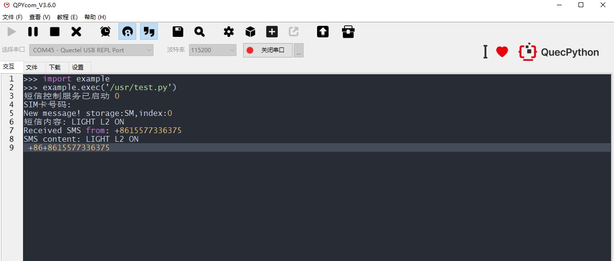

# QuecPython 短信控灯方案


中文 | [English](README EN.MD)

欢迎来到 QuecPython 短信控灯方案仓库！本仓库提供了一个专注于LED控制及短信通知功能的开源项目，适用于远程控制和状态报告，提升设备管理效率。

## 目录


- [介绍](#介绍)
- [功能](#功能)
- 快速开始
  - [先决条件](#先决条件)
  - [安装](#安装)
  - [运行应用程序](#运行应用程序)
- [目录结构](#目录结构)
- [使用](#使用)
- [贡献](#贡献)
- [许可证](https://github.com/QuecPython/solution-wearable/blob/master/README_ZH.MD#许可证)
- [支持](#支持)

## 介绍


QuecPython 推出了针对 LED灯的远程控制方式，例如短信控制LED亮灭。

通过QuectPython封装的接口，仅需几个步骤就可以轻松实现远程控制灯光，无需进行传统的手动开关。

## 功能

- **识别自定义验证码**：如果要控制设备，需要向设备发送包含正确验证码的指令（LIGHT），提高设备安全性。

- **LIGHT L1 ON**：手机发送验证码（LIGHT）+自定义设备号（L1）+设备动作（ON）实现L1设备开灯
- **LIGHT L1 OFF**：手机发送验证码（LIGHT）+自定义设备号（L1）+设备动作（OFF）实现L1设备关灯

## 快速开始

### 先决条件

在开始之前，请确保您具备以下先决条件：

- **硬件**：
  - 一块 QuecPython开发板
  - USB 数据线
  - 电脑（Windows 7、Windows 10 或 Windows 11）
- **软件**：
  - QuecPython 模块的 USB 驱动
  - QPYcom 调试工具
  - QuecPython 固件及相关软件资源
  - Python 文本编辑器（例如，[VSCode](https://code.visualstudio.com/)、[Pycharm](https://www.jetbrains.com/pycharm/download/)）

### 安装

1. **克隆仓库**：

   ```
   git clone https://github.com/aaronchenzhihe/SMS_LED.git
   cd LED_SMS
   ```

   

2. **烧录固件**：

   按照[说明](https://python.quectel.com/doc/Application_guide/zh/dev-tools/QPYcom/qpycom-dw.html#Download-Firmware)将固件烧录到开发板上。

### 运行应用程序


1. **连接硬件**：
   - 使用 USB 数据线将开发板连接到计算机的 USB 端口。
2. **将代码下载到设备**：
   - 启动 QPYcom 调试工具。
   - 将数据线连接到计算机。
   - 按下开发板上的 **PWRKEY** 按钮启动设备。
   - 按照[说明](https://python.quectel.com/doc/Application_guide/zh/dev-tools/QPYcom/qpycom-dw.html#Download-Script)将 `code` 文件夹中的所有文件导入到模块的文件系统中，保留目录结构。
3. **运行应用程序**：
   - 选择 `File` 选项卡。
   - 选择 `_main.py` 脚本。
   - 右键单击并选择 `Run` 或使用`运行`快捷按钮执行脚本。

## 目录结构


```plaintext
solution-LED_SMS/
├── code/
│   ├── _main.py        # 启动控制模块
└── README.md               # 本 README 文件
```


## 使用




## 贡献


我们欢迎对本项目的改进做出贡献！请按照以下步骤进行贡献：

1. Fork 此仓库。
2. 创建一个新分支（`git checkout -b feature/your-feature`）。
3. 提交您的更改（`git commit -m 'Add your feature'`）。
4. 推送到分支（`git push origin feature/your-feature`）。
5. 打开一个 Pull Request。

## 许可证

本项目使用 Apache 许可证。详细信息请参阅 [LICENSE](https://github.com/QuecPython/solution-wearable/blob/master/LICENSE) 文件。

## 支持

如果您有任何问题或需要支持，请参阅 [QuecPython 文档](https://python.quectel.com/doc)。
